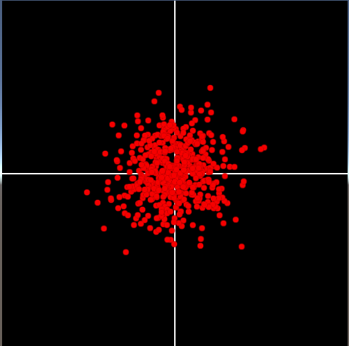
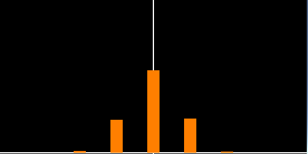
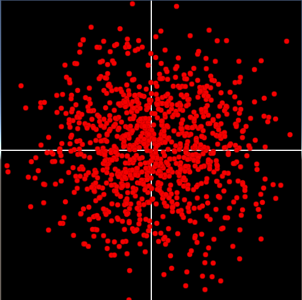
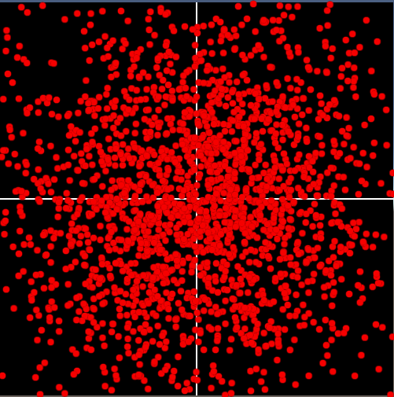
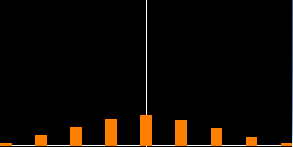
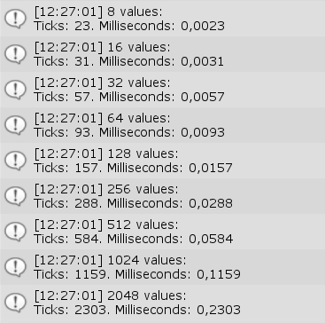
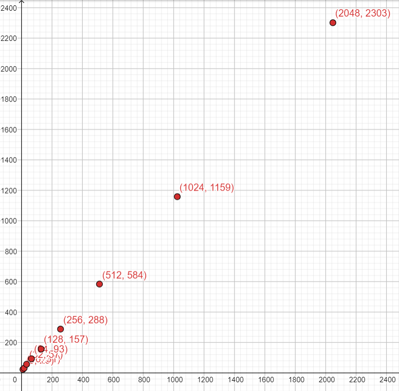

# Gaussian-Random
**An implementation of the Marsaglia polar method for generating random number with a Gaussian distribution.**

The class MyRandom can be used just like the System.Random class and calling the method NextGaussian() will return a double between (-1, 1) with the mean at 0.

### Standard deviation:
From [Wikipedia](https://en.wikipedia.org/wiki/Normal_distribution):
> the standard deviation (SD, also represented by the lower case Greek letter sigma σ for the population standard deviation or the Latin letter s for the sample standard deviation) is a measure of the amount of variation or dispersion of a set of values. A low standard deviation indicates that the values tend to be close to the mean (also called the expected value) of the set, while a high standard deviation indicates that the values are spread out over a wider range.

So with a SD of 1 The method NextGaussian(1) will a distribution that follows a Standard Normal Distribution curve (a standard bell form), if the SD if less than 1 the curve will be more narrow, if it's more than 1 the curve will be more flat.

### Examples (with 1024 values):

#### SD = 0.5:
 

#### SD = 1:
 

#### SD = 1.5:
 

### Performance:
Test made using Unity:

 
